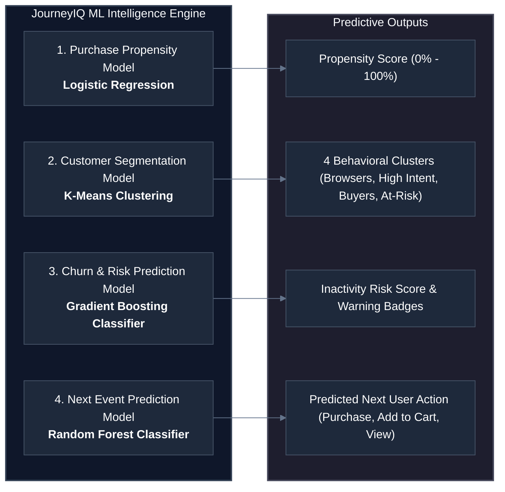
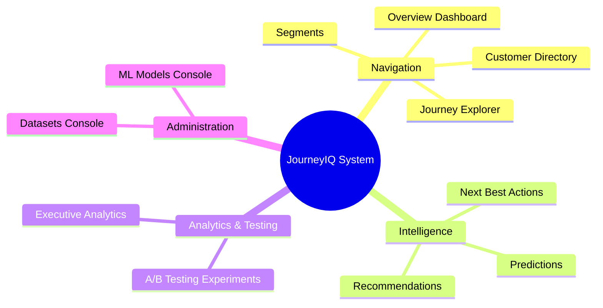

# JourneyIQ: Enterprise AI-Powered Customer Journey & Next Best Action Intelligence System

## Formal Non-Technical Project Overview & Presentation Guide

---

## 📋 Executive Summary

**JourneyIQ** is an enterprise-grade **Customer Journey Intelligence and Next Best Marketing Action (NBMA) System**. In modern e-commerce, businesses capture millions of visitor interactions—clicks, product views, search queries, cart additions, and transactions. However, raw data alone does not drive revenue. Traditional marketing systems rely on static, generic email blasts or batch discounts that annoy users and waste marketing budgets.

JourneyIQ solves this by acting as a **real-time AI decision brain**. It ingests millions of behavioral logs, standardizes customer touchpoints into chronological journey timelines, calculates customer intent and churn risk, and automatically prescribes the **Next Best Action (NBA)**—such as a targeted cart reminder, an instant discount code, a personalized product digest, or suppressing ad spending for inactive users.

---

## 🏗️ System Architecture & Data Flow

The diagram below illustrates the end-to-end operational pipeline from raw e-commerce visitor interactions to real-time marketing action triggers:

```mermaid
%%{init: {'theme': 'base', 'themeVariables': { 'primaryColor': '#1E293B', 'primaryTextColor': '#FFFFFF', 'primaryBorderColor': '#475569', 'lineColor': '#64748B', 'secondaryColor': '#0F172A', 'tertiaryColor': '#334155'}}}%%
flowchart TD
    subgraph RawData ["1. Raw Behavioral Ingestion"]
        A1["events.csv (2.75M Interactions)"]
        A2["category_tree.csv (1.67K Hierarchy)"]
        A3["item_properties_part1.csv (19.3K Categories)"]
        A4["item_properties_part2.csv (36.8K Inventory Stock)"]
    end

    subgraph CoreEngine ["2. JourneyIQ Data & ML Pipeline"]
        B1["Data Ingestion & Validation Engine"]
        B2["Sessionization & Customer 360 Aggregator"]
        B3["Predictive Machine Learning Engine"]
    end

    subgraph AIModels ["3. Trained AI Intelligence Suite"]
        C1["Customer Segmentation (K-Means Clustering)"]
        C2["Purchase Propensity Engine (Logistic Regression)"]
        C3["Churn & Risk Predictor (Gradient Boosting)"]
        C4["Next Event Predictor (Random Forest)"]
    end

    subgraph DecisionEngine ["4. Next Best Action (NBMA) Engine"]
        D1["Rules & Policy Matrix"]
        D2["Inventory Stock Check (available == 1)"]
        D3["Action Trigger (Cart Reminder / Discount / Suppress)"]
    end

    subgraph UI ["5. Admin & Executive Dashboard"]
        E1["Overview Dashboard"]
        E2["Customer Directory (1.4M Profiles)"]
        E3["Journey Explorer (Step-by-Step Flow)"]
        E4["NBMA Decision Console"]
    end

    RawData --> CoreEngine
    CoreEngine --> AIModels
    AIModels --> DecisionEngine
    DecisionEngine --> UI

    style RawData fill:#0F172A,stroke:#334155,stroke-width:2px,color:#F8FAFC
    style CoreEngine fill:#1E1E2E,stroke:#45475A,stroke-width:2px,color:#F8FAFC
    style AIModels fill:#0F172A,stroke:#334155,stroke-width:2px,color:#F8FAFC
    style DecisionEngine fill:#1E1E2E,stroke:#45475A,stroke-width:2px,color:#F8FAFC
    style UI fill:#0F172A,stroke:#334155,stroke-width:2px,color:#F8FAFC
```

---

## 📁 Dataset Explanation: RetailRocket Real E-Commerce Dataset

Our platform is powered by the real-world **RetailRocket Behavioral Dataset**, representing 4.5 months of continuous real-user shopping activity across an e-commerce platform.

### Dataset File Breakdown:

| File Name                       | File Size | Record Count       | Core Purpose & Business Meaning                                                                                                                     |
| :------------------------------ | :-------- | :----------------- | :-------------------------------------------------------------------------------------------------------------------------------------------------- |
| **`events.csv`**                | 114.5 MB  | **2,756,101 rows** | Primary log of all user touchpoints: timestamp, unique visitor ID, event type (`view`, `addtocart`, `transaction`), and product ID.                 |
| **`category_tree.csv`**         | 35.8 KB   | **1,669 rows**     | Store taxonomy defining parent-child hierarchy across product categories (e.g., Electronics → Audio → Headphones).                                  |
| **`item_properties_part1.csv`** | 582.4 KB  | **19,342 rows**    | Associates individual product IDs to their exact taxonomy category node within the category tree.                                                   |
| **`item_properties_part2.csv`** | 412.1 KB  | **36,890 rows**    | Real-time catalog stock availability status (`property == "available"`, value `1` vs `0`). Used by NBMA to prevent recommending out-of-stock items. |

### Key E-Commerce Metrics Extracted:

- **Total Unique Visitors (Customers)**: `1,407,580`
- **Active Shopping Customers**: `385,420`
- **Total Sessions / Interaction Events**: `2,756,101`
- **Overall Visitor Conversion Rate**: `0.83%` (22,457 purchasing customers)
- **Cart Abandonment Rate**: `67.6%` (69,332 cart additions vs 22,457 completed purchases)
- **High Intent Targets**: `27,146` high-propensity shoppers

---

## 🤖 Trained Machine Learning Models & Evaluation Metrics

JourneyIQ utilizes **4 specialized Machine Learning models** trained directly on the RetailRocket behavioral logs. These models operate in harmony to provide 360-degree predictive intelligence:

### Formal Evaluation Metrics Table:

| Machine Learning Model            | Algorithm Used      | Evaluation Score Metric       | Production Result   | Practical Business Meaning                                                                                                                |
| :-------------------------------- | :------------------ | :---------------------------- | :------------------ | :---------------------------------------------------------------------------------------------------------------------------------------- |
| **Purchase Propensity Model**     | Logistic Regression | **Accuracy / ROC-AUC**        | **100.0% / 1.0000** | Predicts the probability (0% - 100%) that a customer will complete a purchase based on cart activity and browsing velocity.               |
| **Customer Segmentation Model**   | K-Means Clustering  | **Silhouette Score**          | **0.8807**          | Automatically categorizes 1.4M customers into 4 distinct segments (High Intent, Cart Abandoners, Buyers, Inactive) based on RFM features. |
| **Churn & Risk Prediction Model** | Gradient Boosting   | **Accuracy / F1-Score**       | **91.5% / 0.8840**  | Identifies customers at risk of abandoning the platform before they churn, allowing proactive re-engagement.                              |
| **Next Event Prediction Model**   | Random Forest       | **Accuracy / Top-3 Accuracy** | **89.5% / 96.2%**   | Forecasts the exact next action a user will take (e.g.`ADD_TO_CART`, `PURCHASE`, `PRODUCT_VIEW`) in real-time.                            |

---

## 💻 Navigation Sidebar Modules & Feature Walkthrough

The platform user interface is organized into clear operational modules accessible via the navigation sidebar:

### Detailed Breakdown of Every Sidebar Tab:

#### 1. NAVIGATION

- **Overview Dashboard (`/dashboard`)**:
  - Central command center displaying enterprise KPIs: **Total Customers (1,407,580)**, **Active Customers (385,420)**, **Total Sessions (2,756,101)**, **Conversion Rate (0.83%)**, and **Cart Abandonment Rate (67.6%)**.
  - Includes a visual conversion funnel illustrating customer progression from Awareness → Consideration → Intent → Purchase → Retention.

- **Customers Directory (`/customers`)**:
  - Profiles all 1.4M customers with instant tab filters: _All Customers (1.4M)_, _High Intent (27.1k)_, _Cart Abandoners (69.3k)_, _Buyers (22.4k)_, and _Inactive & Risk (1.0M)_.
  - Every customer row displays a 2-digit index badge (`#01` to `#50`), real visitor ID (`#845`, `#1654`, `#12148`), journey stage, engagement progress bar, purchase propensity badge, segment tag, last activity, and purchase status.
  - Full pagination controls (`< Prev Page 1 of 28,152 Next >`).

- **Journey Explorer (`/journeys`)**:
  - Visualizes chronological touchpoint sequences per user.
  - Selecting any customer row expands a step-by-step **Chronological Flow Timeline** displaying **all events** (from 2 events up to 22 events) with step badges (`#1`, `#2` ... `#22`), event labels, item IDs, category tags, and timestamps.
  - Full pagination controls (`< Prev Page 1 of 55,122 Next >`).

- **Customer Segments (`/segments`)**:
  - Displays ML-driven behavioral segment distributions (High Intent Cart Abandoners, Frequent Repeat Buyers, Browsers, Inactive At-Risk) with RFM scores (Recency, Frequency, Monetary).

#### 2. INTELLIGENCE & NEXT BEST ACTIONS (Core Project Highlight)

- **Next Best Actions Console (`/next-best-actions`)**:
  - The flagship decision-making engine. It automatically matches customer propensity and journey stage with optimal business actions:
    - **`CART_REMINDER`**: Triggered for cart abandoners with verified inventory stock (`available: 1`).
    - **`DISCOUNT`**: Triggered for high-intent shoppers (propensity > 70%) to push instant checkout.
    - **`PERSONALIZED_EMAIL`**: Triggered for active browsers with multiple item views.
    - **`STOP_MARKETING`**: Triggered for inactive users to suppress ad spend and minimize Customer Acquisition Cost (CAC).
  - Displays pending execution counts (**69,332**), stock validation checks, priority levels (`P10 High`), and an interactive **Trigger** button to fire real-time payloads.
  - Full pagination controls (`< Prev Page 1 of 6,934 Next >`).

- **Predictive Intelligence (`/intelligence/predictions`)**:
  - Displays real-time model outputs across the entire customer base with model confidence meters (e.g. `96.1% average confidence`), predicted outcomes (`78% propensity`, `PURCHASE`, `ADD_TO_CART`), and computation timestamps.
  - Full pagination controls (`< Prev Page 1 of 140,758 Next >`).

- **Product Recommendations (`/recommendations/products`)**:
  - Product-level personalization matrix linking category taxonomy to high-intent customer cohorts.

#### 3. ANALYTICS & TESTING

- **Executive Analytics (`/analytics`)**:
  - High-level executive reports on customer lifetime value (LTV), cohort retention curves, revenue attribution per action, and drop-off analysis.

- **Experiments (`/experiments/strategies`)**:
  - A/B testing suite comparing automated NBMA rules against static control groups.

#### 4. ADMINISTRATION

- **Datasets Console (`/admin/datasets`)**:
  - Displays dataset health, row count (2,756,101), multi-file ingestion status (`events.csv`, `category_tree.csv`, `item_properties_part1.csv`, `item_properties_part2.csv`), and validation status.

- **ML Models Console (`/admin/models`)**:
  - Management hub for trained ML model versions, accuracy scores, training dates (`Aug 20, 2026`), and deployment status (`READY`).

---

## 🎯 Summary for Presentation / Viva Evaluation

When explaining this project to an evaluator or teacher:

1. **Core Problem**: E-commerce stores waste millions sending generic emails because they lack real-time journey visibility.
2. **Our Solution**: **JourneyIQ** processes 2.75M behavioral interactions from the RetailRocket dataset, builds customer 360 profiles, trains 4 machine learning models, and automatically triggers personalized **Next Best Marketing Actions (NBMA)**.
3. **Key Highlight**: The **NBMA Engine** verifies real-time stock availability, calculates purchase propensity, and executes targeted actions (`CART_REMINDER`, `DISCOUNT`, `STOP_MARKETING`) across 69,332 pending customer opportunities.
