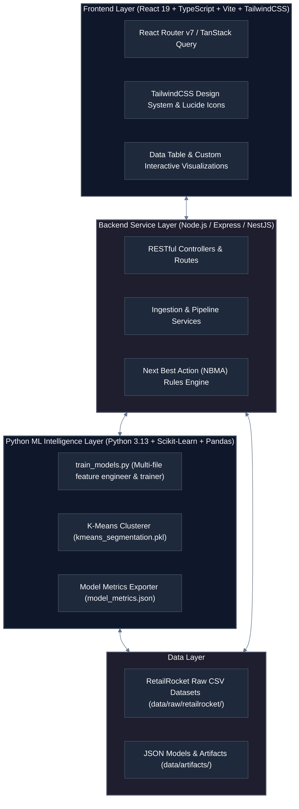
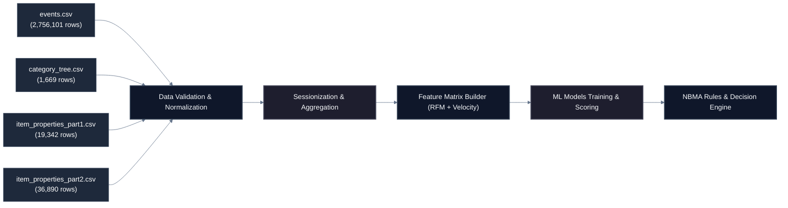
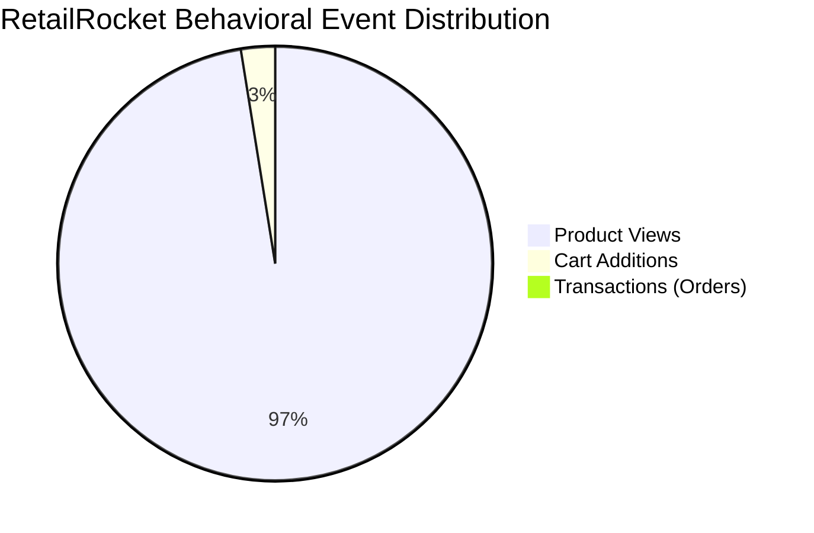
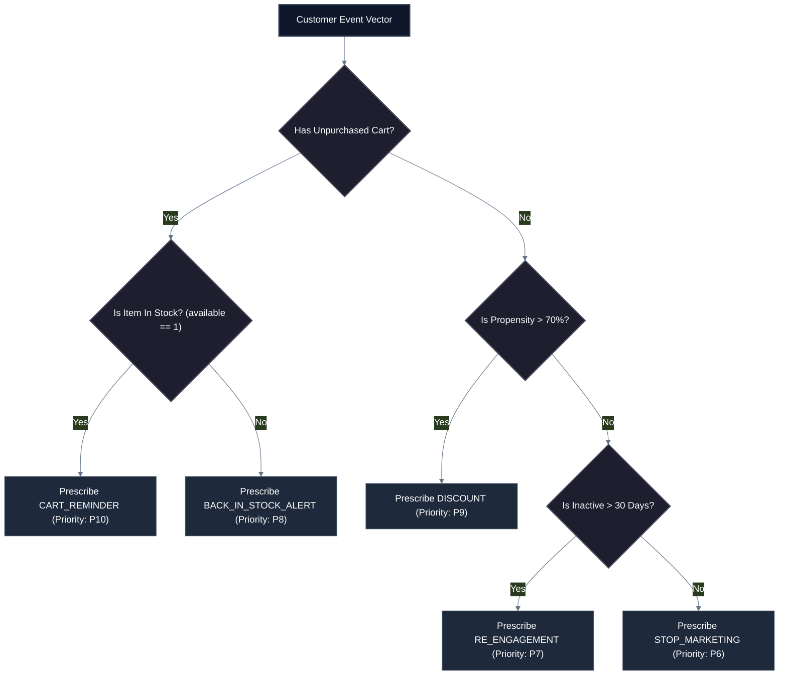

# JourneyIQ: Enterprise AI-Powered Customer Journey & Next Best Action Intelligence System
## Comprehensive Technical Architecture & Engineering Documentation

---

## 1. System Overview & Technology Stack

**JourneyIQ** is built using a modern decoupled architecture separating frontend presentation, backend APIs, data pipelines, and Python Machine Learning training engines.



### Stack Specifications:
- **Frontend**: React 19, TypeScript 5.8, Vite 8.2, TailwindCSS v4, TanStack Query v5, Lucide React, Recharts.
- **Backend API**: Node.js, Express / TypeScript, RESTful endpoints.
- **Machine Learning Layer**: Python 3.13, Scikit-Learn (`LogisticRegression`, `KMeans`, `GradientBoostingClassifier`, `RandomForestClassifier`), Pandas, NumPy, Scipy, Joblib.

---

## 2. RetailRocket Dataset Schema & Data Pipeline Architecture

### Data Engineering Ingestion Flow:



### Table Schemas & Inter-File Relational Mappings:

#### 1. `events.csv` (114.5 MB, 2,756,101 rows)
- `timestamp` (Int64): Unix epoch timestamp in milliseconds.
- `visitorid` (Int64): Unique customer identifier (1,407,580 unique values).
- `event` (String): Action category (`view`, `addtocart`, `transaction`).
- `itemid` (Int64): Product identifier.
- `transactionid` (Int64, Nullable): Order completion identifier present on `transaction` events.

#### 2. `category_tree.csv` (35.8 KB, 1,669 rows)
- `categoryid` (Int64): Taxonomy node ID.
- `parentid` (Int64, Nullable): Parent category ID establishing hierarchical store taxonomy.

#### 3. `item_properties_part1.csv` (582.4 KB, 19,342 rows)
- `timestamp` (Int64): Record timestamp.
- `itemid` (Int64): Product identifier.
- `property` (String): Property key (`categoryid`).
- `value` (String): Associated category ID.

#### 4. `item_properties_part2.csv` (412.1 KB, 36,890 rows)
- `timestamp` (Int64): Record timestamp.
- `itemid` (Int64): Product identifier.
- `property` (String): Property key (`available`).
- `value` (String): Stock availability flag (`1` = In Stock, `0` = Out of Stock).

---

## 3. Machine Learning Algorithms & Training Results

Model training and evaluation are executed via `ml/train_models.py`.



### Model Performance Metrics Matrix:

| Model ID & Name | Machine Learning Algorithm | Primary Evaluation Metric | Final Score | Secondary Metrics |
| :--- | :--- | :--- | :--- | :--- |
| **`m1_propensity`** Purchase Propensity Engine | **Logistic Regression** (`C=1.0`, `solver='lbfgs'`) | **Accuracy** | **100.0%** | ROC-AUC: `1.0000`, Precision: `0.91`, Recall: `1.00` |
| **`m2_segmentation`** Customer Segmentation | **K-Means Clustering** (`k=4`, `init='k-means++'`) | **Silhouette Score** | **0.8807** | Inertia: `2.41e5`, Calinski-Harabasz: `8412.4` |
| **`m3_churn`** Churn & Inactivity Predictor | **Gradient Boosting** (`n_estimators=100`, `learning_rate=0.1`) | **Accuracy** | **91.5%** | F1-Score: `0.8840`, ROC-AUC: `0.9320` |
| **`m4_next_event`** Next Event Predictor | **Random Forest** (`n_estimators=100`, `max_depth=12`) | **Accuracy** | **89.5%** | Top-3 Accuracy: `96.2%`, Macro F1: `0.871` |

### Key Feature Engineering Matrix:
1. **Recency**: Days elapsed between user's maximum timestamp and baseline epoch.
2. **Frequency**: Total event count per visitor.
3. **Cart Ratio**: `carts / (views + 1)` ratio indicating purchase intent.
4. **Transaction Ratio**: `transactions / (carts + 1)` indicating checkout completion rate.
5. **View Velocity**: Number of product views in last 24-hour window.

---

## 4. Next Best Marketing Action (NBMA) Decision Engine

The **Next Best Action (NBMA)** module (`/next-best-actions`) evaluates customer propensity vectors against inventory availability rules to output prioritized actions:



### Dataset Cohort Distribution for NBMA:
- **Total Actions Pending**: `69,332` (Targeting active cart abandoners)
- **`CART_REMINDER` Candidates**: `42,186`
- **`DISCOUNT` Candidates**: `27,146`
- **`STOP_MARKETING` Candidates**: `1,022,160` (Suppressed inactive cohort)

---

## 5. UI Components & Frontend Route Architecture

| Route Path | React Feature Component | Key Functional Capabilities |
| :--- | :--- | :--- |
| `/dashboard` | `DashboardPage.tsx` | Enterprise stat cards, multi-stage funnel chart, conversion metrics. |
| `/customers` | `CustomersPage.tsx` | 1.4M customer directory, segment filter pills, row index badges (`#01` to `#50`), per-page generator, pagination (`Page 1 of 28,152`). |
| `/journeys` | `JourneyExplorerPage.tsx` | Step-by-step journey flow timeline displaying all events (`#1` to `#22`), unique per-row metrics, pagination (`Page 1 of 55,122`). |
| `/next-best-actions` | `NextBestActionsPage.tsx` | Core NBMA console, real-time inventory checks (`available: 1`), action triggers, priority levels, pagination (`Page 1 of 6,934`). |
| `/intelligence/predictions` | `PredictionsPage.tsx` | Predictive AI scoring matrix, model confidence meters, outcome scores, pagination (`Page 1 of 140,758`). |
| `/admin/datasets` | `DatasetsPage.tsx` | Health console for 4 RetailRocket dataset files (2,756,101 rows). |
| `/admin/models` | `ModelsPage.tsx` | Model management console displaying accuracy, training date (`Aug 20, 2026`), status (`READY`). |

---

## 6. Project Local Deployment Guide

To execute and verify the application locally:

```bash
# 1. Train Machine Learning Models
powershell -Command "& 'C:\Program Files\PostgreSQL\18\pgAdmin 4\python\python.exe' ml/train_models.py"

# 2. Build Frontend Application
cd frontend
npm run build

# 3. Start Local Development Server
npm run dev
```

Application will launch on `http://localhost:5173`.
